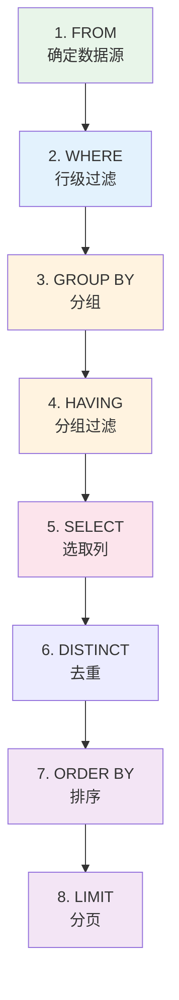

# DQL 数据查询语言

DQL（Data Query Language）是日常开发中使用最频繁的 SQL 语言，核心就是 `SELECT` 语句。

## 一、SELECT 基础语法

```sql
SELECT [DISTINCT] 列1, 列2, ...
FROM 表名
[WHERE 条件]
[GROUP BY 分组列]
[HAVING 分组条件]
[ORDER BY 排序列 ASC|DESC]
[LIMIT 偏移量, 行数];
```

> **执行顺序**：FROM → WHERE → GROUP BY → HAVING → SELECT → ORDER BY → LIMIT

## 二、基础查询

### 2.1 查询所有列

```sql
SELECT * FROM tb_user;
```

> ⚠️ 生产环境不建议使用 `*`，明确列出需要的列可以提升性能。

### 2.2 查询指定列

```sql
SELECT id, user_name, age FROM tb_user;
```

### 2.3 别名（AS）

```sql
-- 列别名
SELECT user_name AS 姓名, age AS 年龄 FROM tb_user;

-- 表别名（多表查询时非常有用）
SELECT u.user_name, u.age FROM tb_user AS u;
```

### 2.4 去重（DISTINCT）

```sql
-- 查询所有不同的部门 ID
SELECT DISTINCT dept_id FROM tb_user;

-- 多列去重（组合去重）
SELECT DISTINCT dept_id, status FROM tb_user;
```

### 2.5 条件查询（WHERE）

```sql
-- 比较运算
SELECT * FROM tb_user WHERE age = 25;
SELECT * FROM tb_user WHERE age != 25;
SELECT * FROM tb_user WHERE age > 25;
SELECT * FROM tb_user WHERE age >= 25;
SELECT * FROM tb_user WHERE age < 25;
SELECT * FROM tb_user WHERE age <= 25;

-- 逻辑运算
SELECT * FROM tb_user WHERE age > 20 AND age < 30;
SELECT * FROM tb_user WHERE dept_id = 1 OR dept_id = 2;
SELECT * FROM tb_user WHERE NOT status = 1;

-- 区间
SELECT * FROM tb_user WHERE age BETWEEN 20 AND 30;

-- IN 集合
SELECT * FROM tb_user WHERE dept_id IN (1, 2, 3);
SELECT * FROM tb_user WHERE dept_id NOT IN (1, 2);

-- NULL 判断
SELECT * FROM tb_user WHERE email IS NULL;
SELECT * FROM tb_user WHERE email IS NOT NULL;
```

### 2.6 模糊查询（LIKE）

```sql
-- % 匹配任意多个字符
SELECT * FROM tb_user WHERE user_name LIKE '张%';      -- 姓张
SELECT * FROM tb_user WHERE email LIKE '%@gmail.com';   -- Gmail 邮箱

-- _ 匹配恰好一个字符
SELECT * FROM tb_user WHERE user_name LIKE '张_';       -- 姓张且名字为两个字

-- ESCAPE 转义
SELECT * FROM tb_user WHERE user_name LIKE '%\_%' ESCAPE '\';  -- 包含下划线
```

### 2.7 正则表达式（REGEXP）

```sql
-- 以某字符开头
SELECT * FROM tb_user WHERE user_name REGEXP '^张';

-- 包含某字符
SELECT * FROM tb_user WHERE email REGEXP 'gmail';

-- 匹配数字
SELECT * FROM tb_user WHERE phone REGEXP '[0-9]{11}';
```

## 三、函数

### 3.1 聚合函数

聚合函数对一组值执行计算并返回单个值，常与 `GROUP BY` 配合使用。

| 函数 | 说明 | 示例 |
|------|------|------|
| `COUNT()` | 计数 | `COUNT(*)`, `COUNT(id)` |
| `SUM()` | 求和 | `SUM(amount)` |
| `AVG()` | 平均值 | `AVG(age)` |
| `MAX()` | 最大值 | `MAX(age)` |
| `MIN()` | 最小值 | `MIN(age)` |

```sql
-- 统计总数
SELECT COUNT(*) FROM tb_user;
SELECT COUNT(*) FROM tb_user WHERE status = 1;

-- 求和
SELECT SUM(amount) AS total_amount FROM tb_order WHERE status = 1;

-- 平均值
SELECT AVG(age) AS avg_age FROM tb_user;

-- 最大/最小值
SELECT MAX(age) AS max_age, MIN(age) AS min_age FROM tb_user;

-- 去重计数
SELECT COUNT(DISTINCT dept_id) FROM tb_user;
```

> **注意**：聚合函数会忽略 NULL 值（COUNT(*) 除外）。

### 3.2 字符串函数

| 函数 | 说明 | 示例 |
|------|------|------|
| `CONCAT(s1, s2, ...)` | 拼接字符串 | `CONCAT('Hello', ' ', 'World')` |
| `LENGTH(s)` | 字符串长度（字节） | `LENGTH('abc')` → 3 |
| `CHAR_LENGTH(s)` | 字符串长度（字符） | `CHAR_LENGTH('你好')` → 2 |
| `UPPER(s)` | 转大写 | `UPPER('abc')` → 'ABC' |
| `LOWER(s)` | 转小写 | `LOWER('ABC')` → 'abc' |
| `SUBSTRING(s, pos, len)` | 截取子串 | `SUBSTRING('hello', 1, 3)` → 'hel' |
| `TRIM(s)` | 去除两端空格 | `TRIM('  abc  ')` → 'abc' |
| `REPLACE(s, old, new)` | 替换 | `REPLACE('abc', 'b', 'x')` → 'axc' |
| `LEFT(s, n)` | 左边 n 个字符 | `LEFT('hello', 3)` → 'hel' |
| `RIGHT(s, n)` | 右边 n 个字符 | `RIGHT('hello', 3)` → 'llo' |

```sql
-- 拼接用户名和邮箱
SELECT CONCAT(user_name, ' (', email, ')') AS user_info FROM tb_user;

-- 手机号脱敏
SELECT CONCAT(LEFT(phone, 3), '****', RIGHT(phone, 4)) AS masked_phone FROM tb_user;
```

### 3.3 日期时间函数

| 函数 | 说明 | 示例 |
|------|------|------|
| `NOW()` | 当前日期时间 | `2024-06-01 10:30:00` |
| `CURDATE()` | 当前日期 | `2024-06-01` |
| `CURTIME()` | 当前时间 | `10:30:00` |
| `DATE(datetime)` | 提取日期 | `DATE('2024-06-01 10:30:00')` → `2024-06-01` |
| `YEAR(date)` | 提取年份 | `YEAR('2024-06-01')` → 2024 |
| `MONTH(date)` | 提取月份 | `MONTH('2024-06-01')` → 6 |
| `DAY(date)` | 提取天数 | `DAY('2024-06-01')` → 1 |
| `DATE_ADD(date, INTERVAL n UNIT)` | 日期加 | `DATE_ADD(NOW(), INTERVAL 7 DAY)` |
| `DATE_SUB(date, INTERVAL n UNIT)` | 日期减 | `DATE_SUB(NOW(), INTERVAL 1 MONTH)` |
| `DATEDIFF(d1, d2)` | 日期差（天） | `DATEDIFF('2024-06-01', '2024-05-01')` → 31 |
| `DATE_FORMAT(date, fmt)` | 格式化日期 | `DATE_FORMAT(NOW(), '%Y-%m-%d')` |

```sql
-- 查询最近 7 天注册的用户
SELECT * FROM tb_user
WHERE create_time >= DATE_SUB(NOW(), INTERVAL 7 DAY);

-- 按年月统计
SELECT DATE_FORMAT(create_time, '%Y-%m') AS month, COUNT(*) AS cnt
FROM tb_user
GROUP BY month;
```

### 3.4 数值函数

| 函数 | 说明 | 示例 |
|------|------|------|
| `ROUND(n, d)` | 四舍五入 | `ROUND(3.1415, 2)` → 3.14 |
| `CEIL(n)` | 向上取整 | `CEIL(3.14)` → 4 |
| `FLOOR(n)` | 向下取整 | `FLOOR(3.99)` → 3 |
| `ABS(n)` | 绝对值 | `ABS(-5)` → 5 |
| `MOD(a, b)` | 取模 | `MOD(10, 3)` → 1 |
| `RAND()` | 随机数（0~1） | `RAND()` → 0.7823... |

### 3.5 流程控制函数

```sql
-- IF 函数：IF(条件, 真值, 假值)
SELECT user_name, IF(status = 1, '启用', '禁用') AS status_text
FROM tb_user;

-- CASE WHEN：类似 Java 的 switch-case
SELECT user_name,
    CASE status
        WHEN 0 THEN '禁用'
        WHEN 1 THEN '启用'
        WHEN 2 THEN '锁定'
        ELSE '未知'
    END AS status_text
FROM tb_user;

-- CASE WHEN 带条件
SELECT user_name, age,
    CASE
        WHEN age < 18 THEN '未成年'
        WHEN age < 30 THEN '青年'
        WHEN age < 50 THEN '中年'
        ELSE '老年'
    END AS age_group
FROM tb_user;
```

## 四、分组查询（GROUP BY）

### 4.1 基本分组

```sql
-- 按部门统计人数
SELECT dept_id, COUNT(*) AS user_count
FROM tb_user
GROUP BY dept_id;

-- 按部门和状态统计
SELECT dept_id, status, COUNT(*) AS cnt
FROM tb_user
GROUP BY dept_id, status;
```

### 4.2 HAVING 过滤分组结果

```sql
-- 查询人数超过 10 人的部门
SELECT dept_id, COUNT(*) AS user_count
FROM tb_user
GROUP BY dept_id
HAVING user_count > 10;

-- 查询平均年龄大于 30 的部门
SELECT dept_id, AVG(age) AS avg_age
FROM tb_user
GROUP BY dept_id
HAVING avg_age > 30;
```

> **WHERE vs HAVING 区别：**
>
> | 特性 | WHERE | HAVING |
> |------|-------|--------|
> | 作用时机 | 分组前过滤 | 分组后过滤 |
> | 能否用聚合函数 | ❌ 不能 | ✅ 可以 |
> | 性能 | 先过滤，性能更好 | 先分组再过滤 |

### 4.3 WITH ROLLUP

```sql
-- 在分组统计结果最后加一行汇总
SELECT dept_id, COUNT(*) AS cnt
FROM tb_user
GROUP BY dept_id WITH ROLLUP;
```

## 五、排序与分页

### 5.1 排序（ORDER BY）

```sql
-- 升序（默认）
SELECT * FROM tb_user ORDER BY age ASC;

-- 降序
SELECT * FROM tb_user ORDER BY create_time DESC;

-- 多列排序
SELECT * FROM tb_user ORDER BY dept_id ASC, age DESC;
```

### 5.2 分页（LIMIT）

```sql
-- LIMIT 偏移量, 行数
-- 第 1 页（偏移 0）
SELECT * FROM tb_user LIMIT 0, 10;

-- 第 2 页（偏移 10）
SELECT * FROM tb_user LIMIT 10, 10;

-- 第 N 页公式：LIMIT (pageNo - 1) * pageSize, pageSize
SELECT * FROM tb_user LIMIT 20, 10;  -- 第 3 页
```

> **深分页优化**：当偏移量很大时，`LIMIT` 性能会急剧下降。
>
> ```sql
> -- ❌ 慢：偏移量太大
> SELECT * FROM tb_user LIMIT 1000000, 10;
>
> -- ✅ 快：利用主键定位
> SELECT * FROM tb_user
> WHERE id > 1000000
> ORDER BY id
> LIMIT 10;
> ```

## 六、JOIN 多表查询

JOIN 是 SQL 中最重要的能力之一，用于从多张表中关联查询数据。

### 6.1 JOIN 类型总览

| 类型 | 说明 | 返回结果 |
|------|------|----------|
| `INNER JOIN` | 内连接 | 只返回两表匹配的行 |
| `LEFT JOIN` | 左连接 | 左表全部 + 右表匹配（不匹配为 NULL） |
| `RIGHT JOIN` | 右连接 | 右表全部 + 左表匹配（不匹配为 NULL） |

### 6.2 INNER JOIN 内连接

只返回两表中满足连接条件的记录。

```sql
-- 查询用户及其部门信息
SELECT u.id, u.user_name, u.age, d.dept_name
FROM tb_user u
INNER JOIN tb_dept d ON u.dept_id = d.id;

-- 可以省略 INNER 关键字
SELECT u.user_name, d.dept_name
FROM tb_user u
JOIN tb_dept d ON u.dept_id = d.id;
```

### 6.3 LEFT JOIN 左连接

返回左表所有记录，即使右表没有匹配。

```sql
-- 查询所有用户及其部门（包括没有部门的用户）
SELECT u.id, u.user_name, d.dept_name
FROM tb_user u
LEFT JOIN tb_dept d ON u.dept_id = d.id;
```

```text
结果示例：
+----+-----------+-----------+
| id | user_name | dept_name |
+----+-----------+-----------+
| 1  | 张三      | 技术部    |  ← 有部门
| 2  | 李四      | NULL      |  ← 没有部门，右表字段为 NULL
| 3  | 王五      | 产品部    |
+----+-----------+-----------+
```

### 6.4 多表 JOIN

```sql
-- 三表关联：用户 + 部门 + 订单
SELECT u.user_name,
       d.dept_name,
       o.order_no,
       o.amount
FROM tb_user u
INNER JOIN tb_dept d ON u.dept_id = d.id
LEFT JOIN tb_order o ON u.id = o.user_id
WHERE u.status = 1
ORDER BY o.amount DESC;
```

### 6.5 自连接

一张表与自身进行 JOIN，常用于树形结构查询。

```sql
-- 假设员工表有 manager_id 指向自身
SELECT e.user_name AS 员工, m.user_name AS 经理
FROM tb_user e
LEFT JOIN tb_user m ON e.manager_id = m.id;
```

## 七、子查询

子查询是嵌套在另一个查询中的 SELECT 语句。

### 7.1 WHERE 子查询

```sql
-- 查询年龄大于平均值的用户
SELECT * FROM tb_user
WHERE age > (SELECT AVG(age) FROM tb_user);

-- 查询技术部的所有用户
SELECT * FROM tb_user
WHERE dept_id = (SELECT id FROM tb_dept WHERE dept_name = '技术部');

-- 查询有订单的用户
SELECT * FROM tb_user
WHERE id IN (SELECT DISTINCT user_id FROM tb_order);

-- 查询没有订单的用户
SELECT * FROM tb_user
WHERE id NOT IN (SELECT DISTINCT user_id FROM tb_order);
```

### 7.2 FROM 子查询

将子查询结果作为临时表使用（必须起别名）。

```sql
-- 查询每个部门年龄最大的用户
SELECT t.dept_id, t.user_name, t.age
FROM (
    SELECT dept_id, user_name, age,
           ROW_NUMBER() OVER (PARTITION BY dept_id ORDER BY age DESC) AS rn
    FROM tb_user
) t
WHERE t.rn = 1;
```

### 7.3 EXISTS / NOT EXISTS

```sql
-- 查询有订单的用户（EXISTS 通常比 IN 性能更好）
SELECT * FROM tb_user u
WHERE EXISTS (
    SELECT 1 FROM tb_order o WHERE o.user_id = u.id
);

-- 查询没有订单的用户
SELECT * FROM tb_user u
WHERE NOT EXISTS (
    SELECT 1 FROM tb_order o WHERE o.user_id = u.id
);
```

> **IN vs EXISTS 选择**：
> - 子查询结果集小 → 用 `IN`
> - 外表小、子查询结果集大 → 用 `EXISTS`

### 7.4 相关子查询

子查询引用了外层查询的列。

```sql
-- 查询每个用户金额最大的订单
SELECT * FROM tb_order o1
WHERE amount = (
    SELECT MAX(amount) FROM tb_order o2 WHERE o2.user_id = o1.user_id
);
```

## 八、窗口函数（MySQL 8.0+）

窗口函数在不改变行数的前提下，对一组数据进行计算。

### 8.1 基本语法

```sql
函数名(参数) OVER (
    [PARTITION BY 分组列]
    [ORDER BY 排序列]
    [ROWS BETWEEN 起始行 AND 结束行]
)
```

### 8.2 常用窗口函数

```sql
-- ROW_NUMBER：行号（不并列）
SELECT user_name, age, dept_id,
    ROW_NUMBER() OVER (PARTITION BY dept_id ORDER BY age DESC) AS rn
FROM tb_user;

-- RANK：排名（并列会跳号）
SELECT user_name, age, dept_id,
    RANK() OVER (PARTITION BY dept_id ORDER BY age DESC) AS rk
FROM tb_user;

-- DENSE_RANK：密集排名（并列不跳号）
SELECT user_name, age, dept_id,
    DENSE_RANK() OVER (PARTITION BY dept_id ORDER BY age DESC) AS drk
FROM tb_user;

-- 聚合窗口函数
SELECT user_name, age, dept_id,
    SUM(age) OVER (PARTITION BY dept_id) AS dept_age_sum,
    AVG(age) OVER () AS total_avg
FROM tb_user;

-- LAG / LEAD：获取前/后行的值
SELECT user_name, age,
    LAG(age, 1) OVER (ORDER BY age) AS prev_age,
    LEAD(age, 1) OVER (ORDER BY age) AS next_age
FROM tb_user;
```

### 8.3 窗口函数应用场景

```sql
-- 每个部门 Top 3 年龄最大的用户
SELECT * FROM (
    SELECT user_name, age, dept_id,
        ROW_NUMBER() OVER (PARTITION BY dept_id ORDER BY age DESC) AS rn
    FROM tb_user
) t WHERE t.rn <= 3;

-- 计算累计金额
SELECT order_no, amount,
    SUM(amount) OVER (ORDER BY create_time) AS running_total
FROM tb_order;
```

## 九、UNION 联合查询

将多个 SELECT 结果合并为一个结果集。

```sql
-- UNION：去重合并
SELECT user_name, age FROM tb_user WHERE dept_id = 1
UNION
SELECT user_name, age FROM tb_user WHERE dept_id = 2;

-- UNION ALL：不去重（性能更好）
SELECT user_name, age FROM tb_user WHERE dept_id = 1
UNION ALL
SELECT user_name, age FROM tb_user WHERE dept_id = 2;
```

> **注意**：UNION 的各 SELECT 必须有相同的列数和兼容的数据类型。

## 十、EXPLAIN 执行计划

使用 `EXPLAIN` 分析 SQL 的执行计划，是性能优化的基础。

```sql
EXPLAIN SELECT * FROM tb_user WHERE dept_id = 1;
```

| 列名 | 说明 |
|------|------|
| `id` | 查询序号 |
| `select_type` | 查询类型（SIMPLE / PRIMARY / SUBQUERY 等） |
| `table` | 访问的表 |
| `type` | 访问类型（性能从好到差） |
| `possible_keys` | 可能使用的索引 |
| `key` | 实际使用的索引 |
| `rows` | 预估扫描行数 |
| `Extra` | 额外信息 |

**type 字段重要程度**：

| type | 说明 | 性能 |
|------|------|------|
| `system` | 表只有一行 | 🟢 最好 |
| `const` | 通过主键/唯一索引查询 | 🟢 极好 |
| `eq_ref` | JOIN 时通过主键/唯一索引 | 🟢 很好 |
| `ref` | 通过普通索引查询 | 🟢 好 |
| `range` | 索引范围扫描 | 🟡 较好 |
| `index` | 全索引扫描 | 🟠 一般 |
| `ALL` | 全表扫描 | 🔴 差 |

## 十一、DQL 完整执行顺序



> 理解执行顺序很重要，例如 WHERE 中不能使用 SELECT 中定义的别名，因为 WHERE 在 SELECT 之前执行。

## 十二、常用查询模板

### 12.1 分页查询

```sql
SELECT id, user_name, age, email, dept_id, create_time
FROM tb_user
WHERE deleted = 0
ORDER BY create_time DESC
LIMIT #{offset}, #{pageSize};
```

### 12.2 统计报表

```sql
-- 每日注册统计
SELECT DATE(create_time) AS reg_date, COUNT(*) AS reg_count
FROM tb_user
WHERE create_time >= '2024-01-01'
GROUP BY DATE(create_time)
ORDER BY reg_date;
```

### 12.3 排行榜

```sql
-- 订单金额 Top 10
SELECT u.user_name, SUM(o.amount) AS total_amount
FROM tb_user u
INNER JOIN tb_order o ON u.id = o.user_id
WHERE o.status = 1
GROUP BY u.id, u.user_name
ORDER BY total_amount DESC
LIMIT 10;
```

### 12.4 分组 Top N

```sql
-- 每个部门订单金额 Top 3 的用户
SELECT * FROM (
    SELECT u.user_name, d.dept_name, SUM(o.amount) AS total,
        ROW_NUMBER() OVER (PARTITION BY d.id ORDER BY SUM(o.amount) DESC) AS rn
    FROM tb_user u
    INNER JOIN tb_dept d ON u.dept_id = d.id
    INNER JOIN tb_order o ON u.id = o.user_id
    GROUP BY u.id, d.id
) t WHERE t.rn <= 3;
```

### 12.5 同比环比

```sql
-- 月度订单统计 + 环比增长
SELECT month, order_count,
    LAG(order_count, 1) OVER (ORDER BY month) AS prev_month,
    ROUND(
        (order_count - LAG(order_count, 1) OVER (ORDER BY month))
        / LAG(order_count, 1) OVER (ORDER BY month) * 100, 2
    ) AS growth_rate
FROM (
    SELECT DATE_FORMAT(create_time, '%Y-%m') AS month, COUNT(*) AS order_count
    FROM tb_order
    GROUP BY month
) t;
```

## 十三、DQL 速查表

| 功能 | 语法 |
|------|------|
| 查询指定列 | `SELECT col1, col2 FROM table;` |
| 去重 | `SELECT DISTINCT col FROM table;` |
| 条件过滤 | `WHERE col = value` |
| 模糊查询 | `WHERE col LIKE '%pattern%'` |
| 范围查询 | `WHERE col BETWEEN a AND b` |
| 集合查询 | `WHERE col IN (v1, v2, v3)` |
| 空值判断 | `WHERE col IS NULL / IS NOT NULL` |
| 分组 | `GROUP BY col` |
| 分组过滤 | `HAVING condition` |
| 排序 | `ORDER BY col ASC/DESC` |
| 分页 | `LIMIT offset, count` |
| 内连接 | `INNER JOIN ... ON ...` |
| 左连接 | `LEFT JOIN ... ON ...` |
| 子查询 | `WHERE col IN (SELECT ...)` |
| 存在判断 | `WHERE EXISTS (SELECT ...)` |
| 联合查询 | `SELECT ... UNION SELECT ...` |
| 窗口函数 | `FUNC() OVER (PARTITION BY ... ORDER BY ...)` |
| 执行计划 | `EXPLAIN SELECT ...` |
