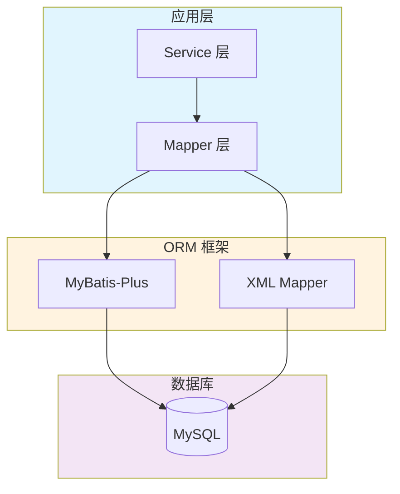

# MySQL 使用指南

MySQL 是最流行的开源关系型数据库之一，广泛应用于 Web 应用开发。

## 一、SQL 语言分类

SQL（Structured Query Language）按功能可分为四大类：

| 分类 | 全称 | 说明 | 常用命令 |
|------|------|------|----------|
| **DDL** | Data Definition Language | 数据定义语言，定义数据库结构 | `CREATE`、`ALTER`、`DROP`、`TRUNCATE` |
| **DML** | Data Manipulation Language | 数据操作语言，操作表中的数据 | `INSERT`、`UPDATE`、`DELETE` |
| **DQL** | Data Query Language | 数据查询语言，查询表中的数据 | `SELECT` |
| **DCL** | Data Control Language | 数据控制语言，控制访问权限 | `GRANT`、`REVOKE` |

> 本文档重点介绍 **DDL**、**DML** 和 **DQL**，其中 DQL 是日常开发中使用最频繁的部分。

## 二、MySQL 与 MyBatis-Plus 的关系

在实际项目中，MySQL 通常不直接使用 JDBC 操作，而是通过 ORM 框架（如 MyBatis-Plus）来简化开发。



**分工说明：**

| 层级 | 职责 | 工具 |
|------|------|------|
| **简单 CRUD** | 单表增删改查 | MyBatis-Plus `BaseMapper` |
| **复杂查询** | 多表关联、动态条件 | XML Mapper |
| **数据库管理** | 建表、改表、索引 | DDL 语句 |
| **数据维护** | 批量导入、数据修复 | DML 语句 |

## 三、文档目录

| 文档 | 说明 |
|------|------|
| [DDL 数据定义](./ddl) | 数据库、表、索引的创建与修改 |
| [DML 数据操作](./dml) | 数据的插入、更新、删除 |
| [DQL 数据查询](./dql) | SELECT 查询、JOIN、子查询、聚合函数（重点） |
| [MyBatis-Plus 集成](./mybatis-plus-integration) | MySQL 与 MyBatis-Plus 结合使用 |

## 四、快速开始

### 4.1 连接 MySQL

```bash
# 命令行连接
mysql -u root -p

# 指定主机和端口
mysql -h 127.0.0.1 -P 3306 -u root -p
```

### 4.2 Spring Boot 集成

```yaml
# application.yml
spring:
  datasource:
    url: jdbc:mysql://localhost:3306/demo_db?useUnicode=true&characterEncoding=utf-8&serverTimezone=Asia/Shanghai
    username: root
    password: your_password
    driver-class-name: com.mysql.cj.jdbc.Driver
```

```xml
<!-- pom.xml -->
<dependency>
    <groupId>mysql</groupId>
    <artifactId>mysql-connector-java</artifactId>
    <version>8.0.33</version>
</dependency>
```

## 五、示例数据

本文档使用以下示例表进行演示：

```sql
-- 部门表
CREATE TABLE tb_dept (
    id BIGINT PRIMARY KEY AUTO_INCREMENT COMMENT '部门ID',
    dept_name VARCHAR(50) NOT NULL COMMENT '部门名称',
    create_time DATETIME DEFAULT CURRENT_TIMESTAMP
);

-- 用户表
CREATE TABLE tb_user (
    id BIGINT PRIMARY KEY AUTO_INCREMENT COMMENT '用户ID',
    user_name VARCHAR(50) NOT NULL COMMENT '用户名',
    age INT COMMENT '年龄',
    email VARCHAR(100) COMMENT '邮箱',
    dept_id BIGINT COMMENT '部门ID',
    status TINYINT DEFAULT 1 COMMENT '状态：0-禁用 1-启用',
    create_time DATETIME DEFAULT CURRENT_TIMESTAMP,
    update_time DATETIME DEFAULT CURRENT_TIMESTAMP ON UPDATE CURRENT_TIMESTAMP,
    deleted TINYINT DEFAULT 0 COMMENT '逻辑删除：0-未删除 1-已删除'
);

-- 订单表
CREATE TABLE tb_order (
    id BIGINT PRIMARY KEY AUTO_INCREMENT COMMENT '订单ID',
    order_no VARCHAR(50) NOT NULL COMMENT '订单编号',
    user_id BIGINT NOT NULL COMMENT '用户ID',
    amount DECIMAL(10, 2) NOT NULL COMMENT '订单金额',
    status TINYINT DEFAULT 0 COMMENT '状态：0-待支付 1-已支付 2-已取消',
    create_time DATETIME DEFAULT CURRENT_TIMESTAMP
);
```
