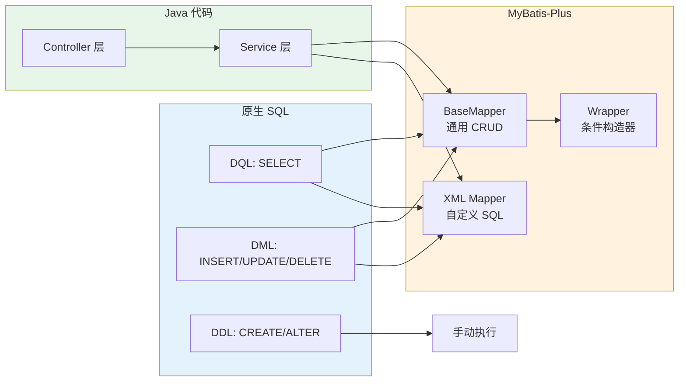
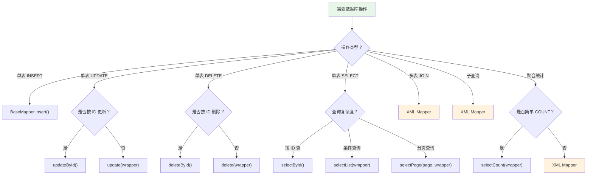

# MySQL 与 MyBatis-Plus 结合使用

本文档展示日常 SQL 操作如何映射到 MyBatis-Plus 的 Java API，帮助你理解 ORM 框架背后的 SQL 逻辑。

## 一、整体架构



**核心思路**：

- **单表 CRUD** → 用 `BaseMapper` + `Wrapper`，无需写 SQL
- **复杂查询**（多表 JOIN、子查询）→ 用 XML Mapper 写原生 SQL
- **DDL 操作** → 手动在数据库执行或用 Flyway/Liquibase 管理

## 二、DML 与 MyBatis-Plus 对照

### 2.1 INSERT 对照

| SQL | MyBatis-Plus |
|-----|-------------|
| `INSERT INTO tb_user (user_name, age) VALUES ('张三', 25)` | `userMapper.insert(user)` |
| 批量 `INSERT INTO tb_user ... VALUES (...), (...)` | `userService.saveBatch(list)` |

```java
// 单条插入
User user = new User();
user.setUserName("张三");
user.setAge(25);
user.setEmail("zhangsan@example.com");
userMapper.insert(user);
// 生成的 SQL: INSERT INTO tb_user (user_name, age, email) VALUES ('张三', 25, 'zhangsan@example.com')

// 批量插入
List<User> userList = Arrays.asList(user1, user2, user3);
userService.saveBatch(userList);
// 生成的 SQL: INSERT INTO tb_user (...) VALUES (...), (...), (...)
```

### 2.2 UPDATE 对照

| SQL | MyBatis-Plus |
|-----|-------------|
| `UPDATE tb_user SET age=26 WHERE id=1` | `userMapper.updateById(user)` |
| `UPDATE tb_user SET status=0 WHERE dept_id=1` | `userMapper.update(user, wrapper)` |

```java
// 按 ID 更新（只更新非 null 字段）
User user = new User();
user.setId(1L);
user.setAge(26);
userMapper.updateById(user);
// 生成的 SQL: UPDATE tb_user SET age=26 WHERE id=1 AND deleted=0

// 条件更新
User user = new User();
user.setStatus(0);
userMapper.update(user, new LambdaUpdateWrapper<User>()
    .eq(User::getDeptId, 1));
// 生成的 SQL: UPDATE tb_user SET status=0 WHERE dept_id=1 AND deleted=0

// 使用 set() 方法更新指定字段
userMapper.update(new LambdaUpdateWrapper<User>()
    .set(User::getStatus, 0)
    .set(User::getUpdateTime, LocalDateTime.now())
    .eq(User::getDeptId, 1));
// 生成的 SQL: UPDATE tb_user SET status=0, update_time='...' WHERE dept_id=1 AND deleted=0
```

### 2.3 DELETE 对照

| SQL | MyBatis-Plus |
|-----|-------------|
| `DELETE FROM tb_user WHERE id=1` | `userMapper.deleteById(1)` |
| `DELETE FROM tb_user WHERE id IN (1,2,3)` | `userMapper.deleteBatchIds(ids)` |
| `DELETE FROM tb_user WHERE status=0` | `userMapper.delete(wrapper)` |

```java
// 按 ID 删除（如果配置了逻辑删除，实际是 UPDATE）
userMapper.deleteById(1L);
// 逻辑删除 SQL: UPDATE tb_user SET deleted=1 WHERE id=1 AND deleted=0
// 物理删除 SQL: DELETE FROM tb_user WHERE id=1

// 批量删除
userMapper.deleteBatchIds(Arrays.asList(1L, 2L, 3L));

// 条件删除
userMapper.delete(new LambdaQueryWrapper<User>()
    .eq(User::getStatus, 0));
```

## 三、DQL 与 MyBatis-Plus 对照

### 3.1 基础查询

| SQL | MyBatis-Plus |
|-----|-------------|
| `SELECT * FROM tb_user WHERE id=1` | `userMapper.selectById(1)` |
| `SELECT * FROM tb_user WHERE id IN (1,2,3)` | `userMapper.selectBatchIds(ids)` |
| `SELECT * FROM tb_user` | `userMapper.selectList(null)` |
| `SELECT COUNT(*) FROM tb_user` | `userMapper.selectCount(null)` |

### 3.2 WHERE 条件对照

| SQL | LambdaQueryWrapper |
|-----|-------------------|
| `WHERE status = 1` | `.eq(User::getStatus, 1)` |
| `WHERE status != 0` | `.ne(User::getStatus, 0)` |
| `WHERE age > 18` | `.gt(User::getAge, 18)` |
| `WHERE age >= 18` | `.ge(User::getAge, 18)` |
| `WHERE age < 60` | `.lt(User::getAge, 60)` |
| `WHERE age <= 60` | `.le(User::getAge, 60)` |
| `WHERE age BETWEEN 18 AND 30` | `.between(User::getAge, 18, 30)` |
| `WHERE user_name LIKE '%张%'` | `.like(User::getUserName, "张")` |
| `WHERE user_name LIKE '张%'` | `.likeRight(User::getUserName, "张")` |
| `WHERE dept_id IN (1,2,3)` | `.in(User::getDeptId, ids)` |
| `WHERE email IS NULL` | `.isNull(User::getEmail)` |
| `WHERE email IS NOT NULL` | `.isNotNull(User::getEmail)` |

```java
// SQL:
// SELECT * FROM tb_user
// WHERE status = 1
//   AND age >= 18
//   AND user_name LIKE '%张%'
// ORDER BY create_time DESC
// LIMIT 0, 10

List<User> users = userMapper.selectList(
    new LambdaQueryWrapper<User>()
        .eq(User::getStatus, 1)
        .ge(User::getAge, 18)
        .like(User::getUserName, "张")
        .orderByDesc(User::getCreateTime)
);
```

### 3.3 条件组合对照

| SQL | LambdaQueryWrapper |
|-----|-------------------|
| `WHERE a=1 AND b=2` | `.eq(A, 1).eq(B, 2)` |
| `WHERE a=1 OR b=2` | `.eq(A, 1).or().eq(B, 2)` |
| `WHERE a=1 AND (b=2 OR c=3)` | `.eq(A, 1).and(w -> w.eq(B, 2).or().eq(C, 3))` |

```java
// SQL:
// WHERE status = 1 AND (user_name LIKE '%张%' OR email LIKE '%@gmail.com')

userMapper.selectList(
    new LambdaQueryWrapper<User>()
        .eq(User::getStatus, 1)
        .and(w -> w.like(User::getUserName, "张")
                   .or()
                   .like(User::getEmail, "@gmail.com"))
);
```

### 3.4 动态条件

```java
// 前端传入的参数可能为 null，需要动态拼接条件
// SQL 会根据参数是否为空动态生成

public List<User> search(String name, Integer minAge, Integer maxAge, Integer status) {
    return userMapper.selectList(
        new LambdaQueryWrapper<User>()
            .like(StringUtils.isNotBlank(name), User::getUserName, name)
            .ge(minAge != null, User::getAge, minAge)
            .le(maxAge != null, User::getAge, maxAge)
            .eq(status != null, User::getStatus, status)
            .orderByDesc(User::getCreateTime)
    );
}

// 当 name="张", minAge=null, maxAge=30, status=1 时，生成的 SQL：
// SELECT * FROM tb_user
// WHERE user_name LIKE '%张%'
//   AND age <= 30
//   AND status = 1
// ORDER BY create_time DESC
```

### 3.5 分页对照

| SQL | MyBatis-Plus |
|-----|-------------|
| `SELECT * FROM tb_user LIMIT 0, 10` | `new Page<>(1, 10)` |
| `SELECT * FROM tb_user LIMIT 10, 10` | `new Page<>(2, 10)` |

```java
// SQL:
// SELECT COUNT(*) FROM tb_user WHERE status = 1
// SELECT * FROM tb_user WHERE status = 1 LIMIT 0, 10

Page<User> page = new Page<>(1, 10);  // 第 1 页，每页 10 条
Page<User> result = userMapper.selectPage(page,
    new LambdaQueryWrapper<User>()
        .eq(User::getStatus, 1)
        .orderByDesc(User::getCreateTime)
);

result.getTotal();     // 总记录数（自动执行 COUNT 查询）
result.getPages();     // 总页数
result.getCurrent();   // 当前页码
result.getRecords();   // 数据列表
```

### 3.6 JOIN 查询

MyBatis-Plus 的 `BaseMapper` 不支持 JOIN，需要通过 XML Mapper 实现：

```java
// Mapper 接口
@Mapper
public interface UserMapper extends BaseMapper<User> {

    // 多表关联查询
    IPage<UserVO> selectUserWithDept(Page<?> page, @Param("name") String name);
}
```

```xml
<!-- UserMapper.xml -->
<select id="selectUserWithDept" resultType="UserVO">
    SELECT u.id, u.user_name, u.age, u.email,
           d.dept_name,
           COUNT(o.id) AS order_count,
           IFNULL(SUM(o.amount), 0) AS total_amount
    FROM tb_user u
    LEFT JOIN tb_dept d ON u.dept_id = d.id
    LEFT JOIN tb_order o ON u.id = o.user_id AND o.status = 1
    <where>
        u.deleted = 0
        <if test="name != null and name != ''">
            AND u.user_name LIKE CONCAT('%', #{name}, '%')
        </if>
    </where>
    GROUP BY u.id, u.user_name, u.age, u.email, d.dept_name
    ORDER BY u.create_time DESC
</select>
```

```java
// 使用
IPage<UserVO> result = userMapper.selectUserWithDept(
    new Page<>(1, 10), "张"
);
```

### 3.7 聚合查询

| SQL | MyBatis-Plus 方式 |
|-----|------------------|
| `SELECT COUNT(*) FROM tb_user WHERE status=1` | `selectCount(wrapper)` |
| `SELECT MAX(age) FROM tb_user` | `selectObjs` 或 XML |
| `SELECT dept_id, COUNT(*) FROM tb_user GROUP BY dept_id` | XML Mapper |

```java
// 简单计数
Long count = userMapper.selectCount(
    new LambdaQueryWrapper<User>().eq(User::getStatus, 1));

// 复杂聚合查询 → 用 XML
```

```xml
<!-- 按部门统计 -->
<select id="selectDeptStat" resultType="DeptStatVO">
    SELECT d.dept_name,
           COUNT(u.id) AS user_count,
           ROUND(AVG(u.age), 1) AS avg_age
    FROM tb_dept d
    LEFT JOIN tb_user u ON d.id = u.dept_id AND u.deleted = 0
    GROUP BY d.id, d.dept_name
    ORDER BY user_count DESC
</select>
```

## 四、SQL 到 MyBatis-Plus 选型指南



## 五、完整业务示例

以「用户管理」模块为例，展示 SQL 与 MyBatis-Plus 的完整配合：

### 5.1 实体类

```java
@Data
@TableName("tb_user")
public class User {
    @TableId(type = IdType.AUTO)
    private Long id;

    private String userName;
    private Integer age;
    private String email;
    private Long deptId;
    private Integer status;

    @TableField(fill = FieldFill.INSERT)
    private LocalDateTime createTime;

    @TableField(fill = FieldFill.INSERT_UPDATE)
    private LocalDateTime updateTime;

    @TableLogic
    private Integer deleted;
}
```

### 5.2 Mapper 接口

```java
@Mapper
public interface UserMapper extends BaseMapper<User> {

    // 复杂查询走 XML
    IPage<UserVO> selectUserPage(Page<?> page,
                                  @Param("name") String name,
                                  @Param("deptId") Long deptId,
                                  @Param("status") Integer status);

    UserDetailVO selectUserDetail(@Param("id") Long id);
}
```

### 5.3 XML Mapper

```xml
<?xml version="1.0" encoding="UTF-8"?>
<!DOCTYPE mapper PUBLIC "-//mybatis.org//DTD Mapper 3.0//EN"
        "http://mybatis.org/dtd/mybatis-3-mapper.dtd">
<mapper namespace="com.example.mapper.UserMapper">

    <!-- 分页查询（多表关联） -->
    <select id="selectUserPage" resultType="UserVO">
        SELECT u.id, u.user_name, u.age, u.email, u.status,
               d.dept_name,
               u.create_time
        FROM tb_user u
        LEFT JOIN tb_dept d ON u.dept_id = d.id
        <where>
            u.deleted = 0
            <if test="name != null and name != ''">
                AND u.user_name LIKE CONCAT('%', #{name}, '%')
            </if>
            <if test="deptId != null">
                AND u.dept_id = #{deptId}
            </if>
            <if test="status != null">
                AND u.status = #{status}
            </if>
        </where>
        ORDER BY u.create_time DESC
    </select>

    <!-- 用户详情（含部门 + 订单统计） -->
    <select id="selectUserDetail" resultType="UserDetailVO">
        SELECT u.id, u.user_name, u.age, u.email, u.status,
               d.dept_name,
               COUNT(o.id) AS order_count,
               IFNULL(SUM(o.amount), 0) AS total_amount
        FROM tb_user u
        LEFT JOIN tb_dept d ON u.dept_id = d.id
        LEFT JOIN tb_order o ON u.id = o.user_id AND o.deleted = 0
        WHERE u.id = #{id} AND u.deleted = 0
        GROUP BY u.id
    </select>

</mapper>
```

### 5.4 Service 层

```java
@Service
public class UserService extends ServiceImpl<UserMapper, User> {

    /**
     * 分页查询用户列表
     * 对应 SQL: SELECT u.*, d.dept_name FROM tb_user u LEFT JOIN tb_dept d ...
     */
    public IPage<UserVO> queryPage(UserQueryDTO query) {
        return baseMapper.selectUserPage(
            new Page<>(query.getPageNo(), query.getPageSize()),
            query.getName(),
            query.getDeptId(),
            query.getStatus()
        );
    }

    /**
     * 新增用户
     * 对应 SQL: INSERT INTO tb_user (user_name, age, email, dept_id) VALUES (...)
     */
    public Long addUser(AddUserDTO dto) {
        User user = new User();
        BeanUtils.copyProperties(dto, user);
        save(user);  // 等价于 baseMapper.insert(user)
        return user.getId();
    }

    /**
     * 批量更新用户状态
     * 对应 SQL: UPDATE tb_user SET status=#{status} WHERE id IN (...)
     */
    public void batchUpdateStatus(List<Long> ids, Integer status) {
        update(new LambdaUpdateWrapper<User>()
            .set(User::getStatus, status)
            .in(User::getId, ids)
        );
    }

    /**
     * 批量删除（逻辑删除）
     * 对应 SQL: UPDATE tb_user SET deleted=1 WHERE id IN (...) AND deleted=0
     */
    public void batchDelete(List<Long> ids) {
        removeByIds(ids);
    }

    /**
     * 查询指定部门的用户年龄分布
     * 对应 SQL: SELECT age, COUNT(*) AS cnt FROM tb_user WHERE dept_id=? GROUP BY age
     */
    public List<AgeDistributionVO> getAgeDistribution(Long deptId) {
        return baseMapper.selectAgeDistribution(deptId);
    }
}
```

## 六、对照速查表

| 原生 SQL | MyBatis-Plus API | 说明 |
|----------|-----------------|------|
| `INSERT INTO ... VALUES ...` | `insert(entity)` | 单条插入 |
| 批量 `INSERT` | `saveBatch(list)` | 批量插入 |
| `UPDATE ... SET ... WHERE id=?` | `updateById(entity)` | 按 ID 更新 |
| `UPDATE ... SET ... WHERE ...` | `update(entity, wrapper)` | 条件更新 |
| `DELETE FROM ... WHERE id=?` | `deleteById(id)` | 按 ID 删除 |
| `DELETE FROM ... WHERE ... IN (...)` | `deleteBatchIds(ids)` | 批量删除 |
| `DELETE FROM ... WHERE ...` | `delete(wrapper)` | 条件删除 |
| `SELECT * FROM ... WHERE id=?` | `selectById(id)` | 按 ID 查询 |
| `SELECT * FROM ... WHERE id IN (...)` | `selectBatchIds(ids)` | 批量 ID 查询 |
| `SELECT * FROM ... WHERE ...` | `selectList(wrapper)` | 条件查询 |
| `SELECT COUNT(*) FROM ... WHERE ...` | `selectCount(wrapper)` | 计数 |
| `SELECT ... LIMIT offset, size` | `selectPage(page, wrapper)` | 分页查询 |
| 多表 `JOIN` | XML Mapper | 关联查询 |
| 子查询 | XML Mapper | 嵌套查询 |
| `GROUP BY` + 聚合 | XML Mapper | 统计查询 |
